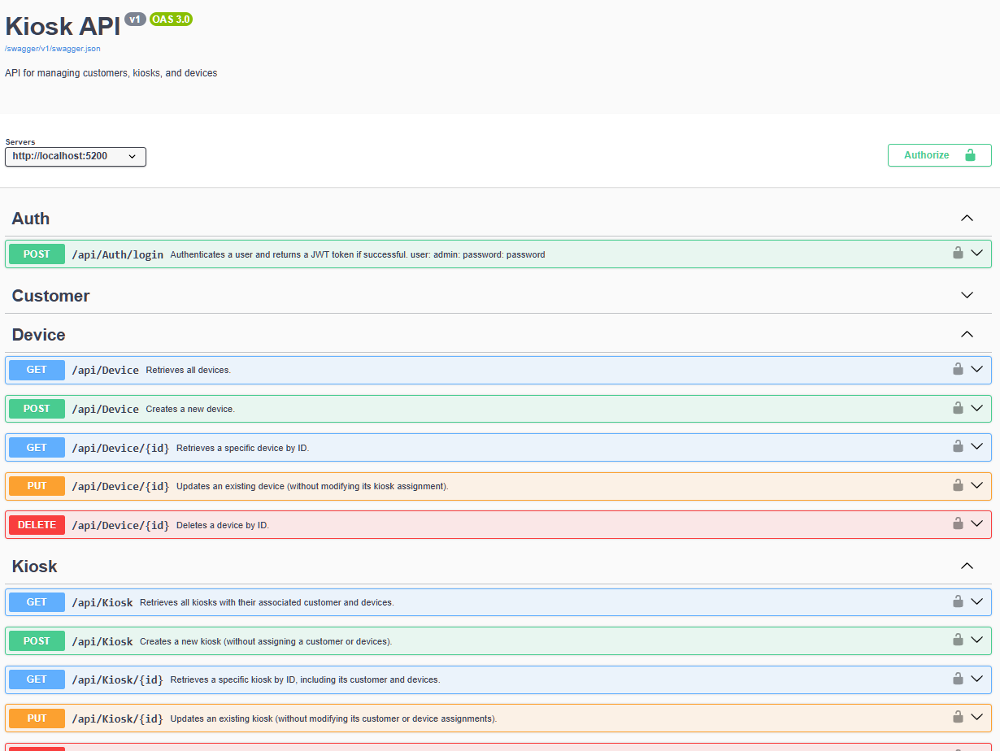

# Kiosk API REST for technical knowledge test

The API emulates the management of kiosk terminals using three entities structured as follows:
  - Customer: Customers that can own one or more kiosk terminals. A customer may have from 0 to N associated kiosks.
  - Kiosk: A kiosk terminal. It is associated with a single Customer and may have from 0 to M associated Devices.
  - Device: Devices or peripherals that are part of a kiosk terminal.

**Considerations:**
  - When the API project starts, migrations and seeding are applied idempotently. I am aware this is not the optimal approach in a real-world environment. I have chosen it for this technical test for simplicity.
  - I am aware that the Get All action in the Customer controller retrieves all nested child elements, which would negatively impact performance in a real-world scenario with larger datasets. I´ve implemented it this way for simplicity in this technical test, but in a production environment, I would implement pagination and filtering to optimize performance and resource usage, as well as for not getting into so heavy object in memory.
 - JWT authentication is implemented with hardcoded credentials for simplicity: **admin/password**. In a production environment, I would implement a more robust authentication mechanism, such as integrating with an identity provider or using a database to manage user credentials securely.
 - Known improvements:
   - Add a global exception handler to catch unhandled exceptions and return consistent error responses.
   - Refine data model and Controller actions.
   - Implement more unit tests to cover edge cases and increase code coverage.
## Features

- **.Net WebAPI 9.0**
   - RESTful API
   - Dependency injection pattern
   - Autommapper for DTO/Entity mapping
   - Entity Framework Core for data access
   - SwaggerUI
   - JWT Auth (hardcoded credntials for simplicity)
   - CLEAN
- **SQL Server on Docker**
    - Docker Compose configuration 
    - Azure SQL Server Edge image for quick local development

## Requirements
- .Net SDK 9.0
- Docker Desktop

## Installation & Running
### Unattended Mode
1. Clone repository:
   ```bash
   git clone https://github.com/nitrocked/Kiosk.git
   ```
2. Thrust certificate for localhost (required for HTTPS):
   ```bash
   dotnet dev-certs https --trust
   ```
3. Run according script that will run all required steps:
   - For Windows:
   ```bash
   cd Kiosk
   .\run-kiosk.ps1
   ```
   - For Linux/Mac:
   ```bash
   cd Kiosk
   chmod +x run-kiosk.sh
   ./run-kiosk.sh
   ```

   - Swagger UI will be available at https://localhost:5200/swagger/index.html

### Manual Mode
1. Clone repository:
   ```bash
   git clone https://github.com/nitrocked/Kiosk.git
   ```

2. Start docker container once inside the directory:
   ```bash
   cd Kiosk
   docker-compose up -d
   ```
3. Thrust certificate for localhost (required for HTTPS):
   ```bash
   dotnet dev-certs https --trust
   ```

4. [Optional] Run Unit Tests:
  - Domain tests:
   ```bash
    dotnet test Kiosk.Domain.Tests -v minimal
   ```
   - API tests:
    ```bash
      dotnet test Kiosk.Api.Tests -v minimal
    ```

4. Build and run project:
   ```bash
   dotnet restore
   dotnet build
   dotnet run --project Kiosk.Api
   ```
   Or in the Kiosk.Api directory:
   ```bash
   cd Kiosk.Api
   dotnet restore
   dotnet run
   ```

5. About Authentication (JWT)
   The API is secured with JWT authentication. Use the following default credentials to obtain a token:
   - **Username:** admin
   - **Password:** password
   
   To authenticate:
   - Call `POST /api/auth/login` with the credentials to get a JWT token
   - In SwaggerUI:
      - Click the **"Authorize"** button (top right), then paste `Bearer <your_token>` in the value field
      - All subsequent requests will include the authentication header automatically
   - In your preferred API client tool (Postman, curl, etc):
      - Add the header `Authorization: Bearer <your_token>` to all requests

6. Run API by integrated SwaggerUI or your preferred client tool:
   ```
   http://localhost:5200/swagger/index.html
   ```
